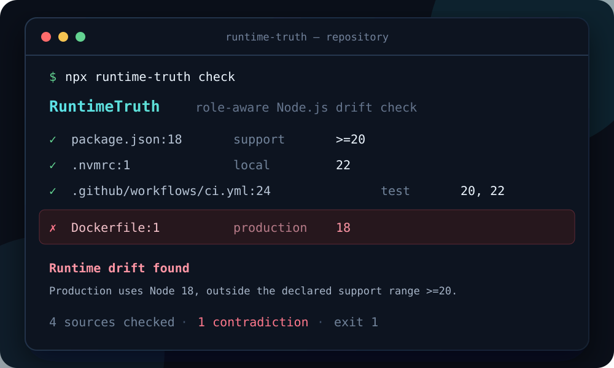

<p align="center">
  
</p>

<h1 align="center">RuntimeTruth</h1>

<p align="center">
  <strong>Stop shipping the wrong Node.js.</strong><br>
  A zero-config check for runtime drift across local development, CI, Docker, and <code>package.json</code>.
</p>

<p align="center">
  <a href="https://github.com/flowzygames/runtime-truth/actions/workflows/ci.yml"></a>
  <a href="LICENSE"></a>
  
  
</p>

```sh
npx --yes github:flowzygames/runtime-truth check
```

<p align="center">
  
</p>

RuntimeTruth reads the version declarations already in your repository, understands what each one *means*, and reports contradictions with file and line context. There is no config file to maintain, account to create, or service to trust.

## The problem

A repository can quietly contain several different answers to “which Node.js do we use?”

```text
package.json            says >=20       supported range
.nvmrc                  says 22         local default
.github/workflows/ci.yml tests 20 and 22 CI matrix
Dockerfile              ships 18        production runtime
```

Those values should not all be identical. They should be **compatible**. A CI matrix of Node 20 and 22 is healthy for a package supporting `>=20`; a production image on Node 18 is not.

That distinction is the point of RuntimeTruth. It compares roles, not strings.

## Quick start

Run it from the root of a Node.js repository:

```sh
npx --yes github:flowzygames/runtime-truth check
```

For repeatable local use, install it as a development dependency:

```sh
npm install --save-dev github:flowzygames/runtime-truth#v0.1.0
```

Then install and run it:

```sh
npm install
npx runtime-truth check
```

A clean result exits with `0`. Runtime drift exits with `1` by default, so the same command works locally and in CI. Invalid CLI usage or an unexpected runtime failure exits with `2`.

## Example

```text
$ npx runtime-truth check

RuntimeTruth

  ✓ package.json:18              engines.node  >=20
  ✓ .nvmrc:1                     local default  22
  ✓ .github/workflows/ci.yml:24  CI matrix      20, 22
  ✗ Dockerfile:1                 production     18

  Runtime drift found
  Production uses Node 18, outside the declared support range >=20.

  4 sources checked · 1 contradiction · exit 1
```

## What it checks

RuntimeTruth discovers common Node.js declarations in:

| Source | Typical role | What RuntimeTruth asks |
| --- | --- | --- |
| `package.json` | Supported range or pinned toolchain | Do selected and deployed versions satisfy the declared support policy? |
| `.nvmrc` | Local default | Is the version developers select actually supported? |
| `.node-version` | Local/tool default | Is the selected version compatible with the project policy? |
| `.tool-versions` | Local/tool default | Is the Node entry compatible with the project policy? |
| `Dockerfile*` | Build or production runtime | Will the image run on a supported Node version? |
| `.github/workflows/*.{yml,yaml}` | Tested runtime or matrix | Does CI exercise supported versions without testing an impossible one? |

If RuntimeTruth finds only one source, it reports what it found and succeeds: one declaration cannot contradict itself.

## GitHub Actions

Add RuntimeTruth next to your existing checks:

```yaml
name: Runtime truth

on:
  pull_request:
  push:
    branches: [main]

jobs:
  runtime-truth:
    runs-on: ubuntu-latest
    steps:
      - uses: actions/checkout@v6
      - uses: flowzygames/runtime-truth@v0.1.0
```

Pinning to `@v0.1.0` makes the first release reproducible. Security-sensitive repositories can pin a full commit SHA instead.

The action also accepts optional controls:

```yaml
      - uses: flowzygames/runtime-truth@v0.1.0
        with:
          path: .
          fail-on: error
```

## CLI reference

```text
runtime-truth check [path] [--format pretty|json|github] [--fail-on error|warning|never]
```

`check` may be omitted, so `runtime-truth .` is equivalent to `runtime-truth check .`.

| Option | Default | Purpose |
| --- | --- | --- |
| `[path]` | `.` | Repository directory to inspect. |
| `--format` | `pretty` | Human output, JSON for tooling, or GitHub workflow commands. |
| `--fail-on` | `error` | Fail on errors, fail on warnings and errors, or report without failing. |
| `--help` | — | Show command help. |
| `--version` | — | Print the installed version. |

Exit status `0` means the configured threshold was not reached, `1` means it was reached, and `2` means the command could not complete.

## Designed to be boring in the best way

- **Zero config.** Repository files are the source of truth.
- **Role-aware.** A supported range, local default, CI matrix, and production image are not treated as equivalent declarations.
- **Actionable.** Findings identify the source and explain the incompatible relationship.
- **Offline.** The check runs entirely on your machine or CI runner.
- **Private.** No telemetry, analytics, account, network API, or source upload.
- **CI-friendly.** Stable success/failure exit behavior makes drift blockable.

## Current limitations

RuntimeTruth is intentionally narrow while its detection earns trust.

- It checks Node.js only; Python, Ruby, Go, Java, and other runtimes are not yet supported.
- It analyzes files in the current repository root. In a monorepo, run it once per independently versioned package.
- It handles explicit Node versions and common semver declarations. Versions assembled dynamically through shell scripts, generated YAML, Docker build arguments, custom actions, or remote includes may not be resolvable statically.
- Docker tags such as `latest`, `lts`, and custom base images do not prove an exact runtime and may be reported as unresolved rather than guessed.
- It detects contradictions; it does not rewrite files automatically.

False confidence is worse than an honest “unknown.” If a declaration cannot be resolved safely, RuntimeTruth says so.

## Contributing

The easiest useful contribution is a small, anonymized fixture showing a real version pattern that RuntimeTruth misses or misreads. Parser improvements, clearer diagnostics, documentation, and cross-platform testing are all welcome.

Read [CONTRIBUTING.md](CONTRIBUTING.md) for the development flow, browse the [roadmap](ROADMAP.md), or open a structured [source-support request](https://github.com/flowzygames/runtime-truth/issues/new?template=source-request.yml).

Please review the [Code of Conduct](CODE_OF_CONDUCT.md) before participating. Security reports belong in [GitHub's private vulnerability reporting](https://github.com/flowzygames/runtime-truth/security/advisories/new), not in a public issue.

## License

[MIT](LICENSE) © 2026 Zachary Spero
